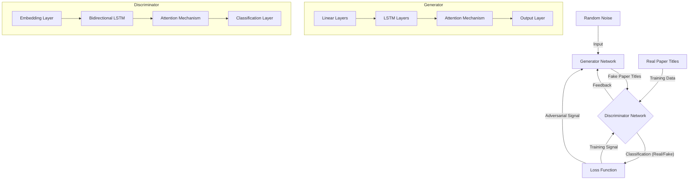
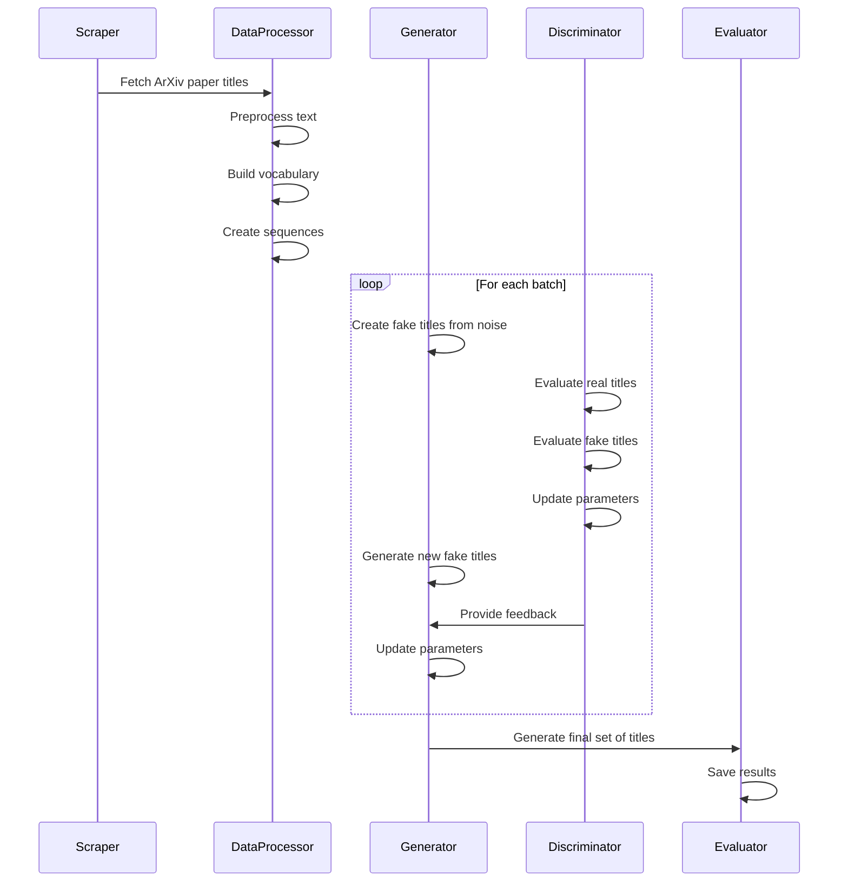

# GAN Paper Title Generator

This repository implements a Generative Adversarial Network (GAN) for creating synthetic academic paper titles, as described in the accompanying article ["An Article About GANs Because Companies Aren't Hiring Junior Developers"](https://ibzie.medium.com/an-article-about-gans-because-companies-arent-hiring-junior-developers-b54862e24b8c).

## 📑 Table of Contents

- [Introduction](#introduction)
- [Architecture](#architecture)
- [Requirements](#requirements)
- [Installation](#installation)
- [Usage](#usage)
- [How It Works](#how-it-works)
- [Project Structure](#project-structure)
- [Ethical Considerations](#ethical-considerations)
- [Limitations](#limitations)
- [Contributing](#contributing)
- [License](#license)

## 🌟 Introduction

This project demonstrates how GANs can be used for text generation, specifically academic paper titles related to GAN research. It implements the "Gene and Dee" analogy from the accompanying article - where two neural networks compete against each other:

- **Gene (Generator)**: Creates fake paper titles from random noise
- **Dee (Discriminator)**: Tries to distinguish between real and fake paper titles

Through this adversarial process, the Generator learns to create increasingly convincing academic paper titles.

## 🏗️ Architecture

The GAN architecture consists of two core components - the Generator and Discriminator networks - that work in tandem:



### Network Details

Both networks utilize LSTM Architectures with attention mechanisms:

1. **Generator**:
   - Processes random noise through fully connected layers
   - Transforms into sequence embeddings via multi-layer LSTM
   - Applies attention mechanism to focus on important token positions
   - Maps to vocabulary distribution through linear projection

2. **Discriminator**:
   - Embeds input tokens into continuous vector representations
   - Processes via bidirectional LSTM to capture contextual relationships
   - Uses attention to weight important features
   - Outputs a probability indicating whether the input is real or fake

## 📋 Requirements

- Python 3.8+
- PyTorch 1.8+
- NLTK
- Pandas
- Beautiful Soup 4
- Matplotlib
- tqdm
- scikit-learn

## 💻 Installation

```bash
# Clone the repository
git clone https://github.com/Ibzie/GAN-Based-Paper-Title-Generator.git
cd generative-adversarial-networks

# Create a virtual environment (optional but recommended)
python -m venv venv
source venv/bin/activate  # On Windows: venv\Scripts\activate

# Install dependencies
pip install -r requirements.txt

# Download required NLTK data
python -c "import nltk; nltk.download('punkt'); nltk.download('stopwords')"
```

## 🚀 Usage

### Running the Model

To run the model:

```bash
python main.py
```

This will:
1. Scrape ArXiv for paper titles related to GANs (limited to 100 for ethical considerations)
2. Process and prepare the data
3. Demonstrate the GAN architecture
4. Generate synthetic paper titles
5. Save the model files and synthetic titles

Note: This implementation is designed to showcase GAN architecture and functionality rather than achieve state-of-the-art results. It runs in about 10 seconds and is meant for educational purposes.

## 🧠 How It Works

The training process follows this workflow:



## 📁 Project Structure
You should get files like these after running this script

```
GENERATIVE-ADVERSARIAL-NETWORKS/
├── arxiv_title_discriminator.pth   # Saved discriminator model
├── arxiv_title_generator.pth       # Saved generator model
├── main.py                         # Main script to run the GAN
├── README.md                       # This documentation
├── requirements.txt                # Kind of need these to run the file
└── synthetic_arxiv_titles.csv      # Generated paper titles
```

## 🔍 Ethical Considerations

This project incorporates several ethical considerations:

1. **Data Collection**: Uses minimal scraping with appropriate rate limiting and respects ArXiv's servers
2. **Synthetic Data**: Generates artificial examples rather than copying existing work
3. **Transparency**: Code and method fully documented to ensure understanding of how titles are generated
4. **Use Case**: Focuses on academic title generation for educational purposes

## 🚧 Limitations

- Limited training data (100 titles) restricts the diversity of outputs
- Some generated titles may lack semantic coherence despite grammatical correctness
- GAN training instability can sometimes produce lower quality results
- The text-based GAN approach has been largely superseded by transformer models for most NLP tasks
- This implementation prioritizes educational clarity over performance

## 🤝 Contributing

Contributions are welcome! Please feel free to submit a Pull Request.

1. Fork the repository
2. Create your feature branch (`git checkout -b feature/AmazingFeature`)
3. Commit your changes (`git commit -m 'Add some AmazingFeature'`)
4. Push to the branch (`git push origin feature/AmazingFeature`)
5. Open a Pull Request

## 📄 License

This project is licensed under the MIT License

---

*This implementation accompanies the article "An Article About GANs Because Companies Aren't Hiring Junior Developers". If you found it helpful, consider connecting on [LinkedIn](https://www.linkedin.com/in/ibrahim-akhtar-ab543823b/).*